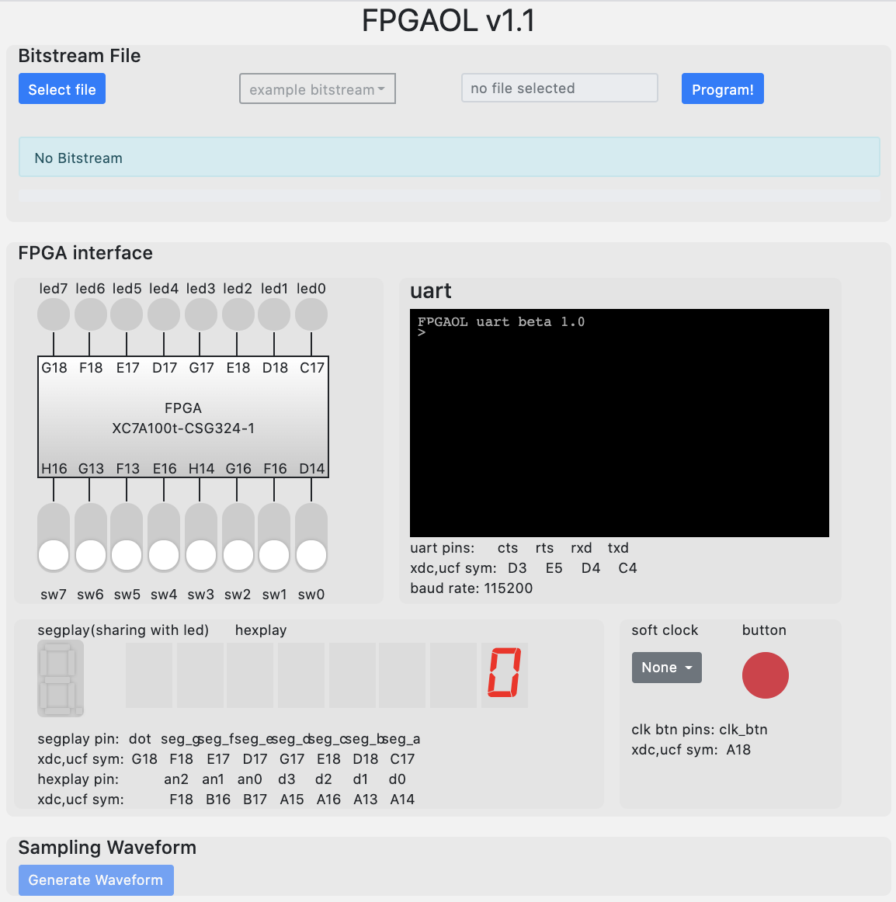
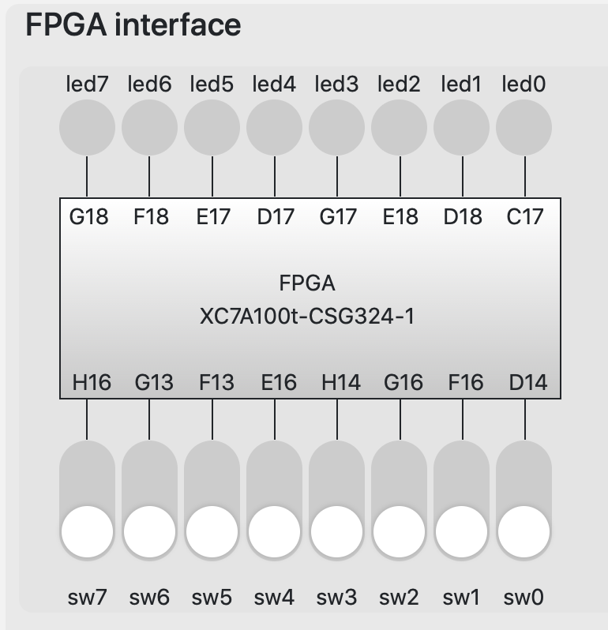
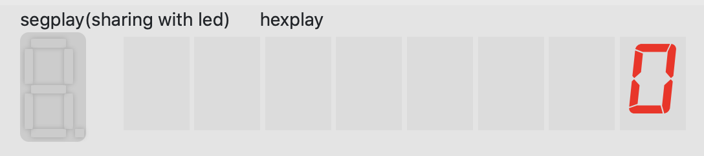
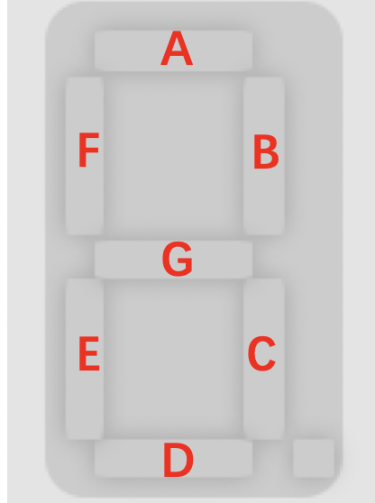
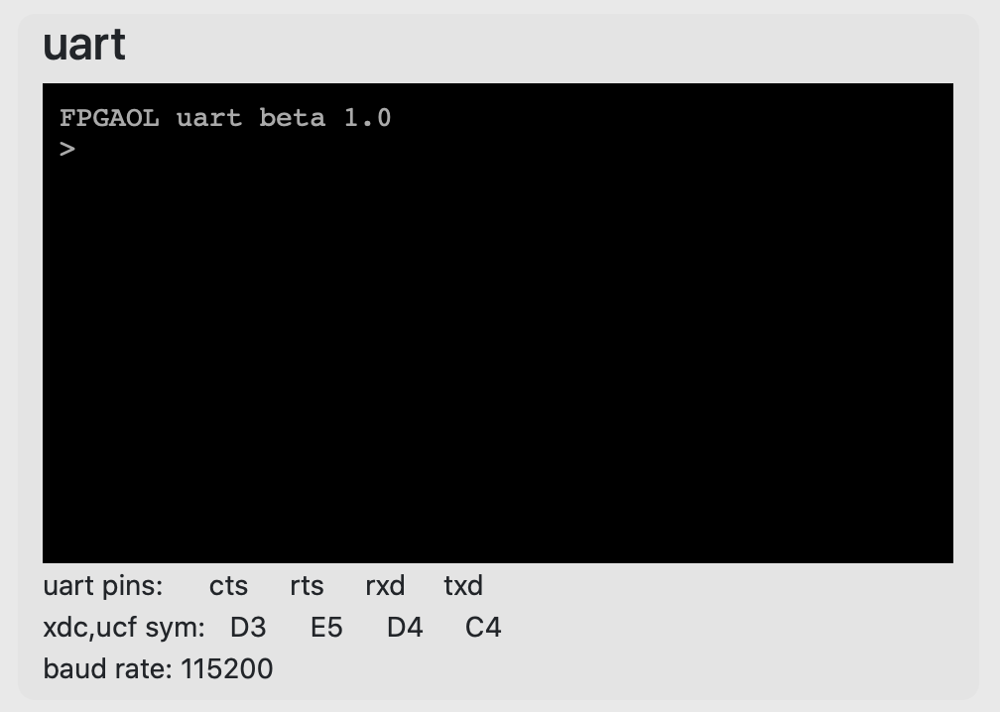
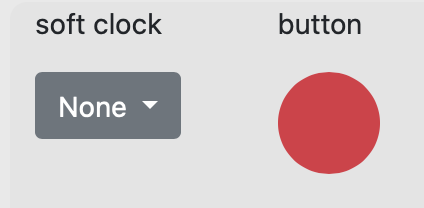
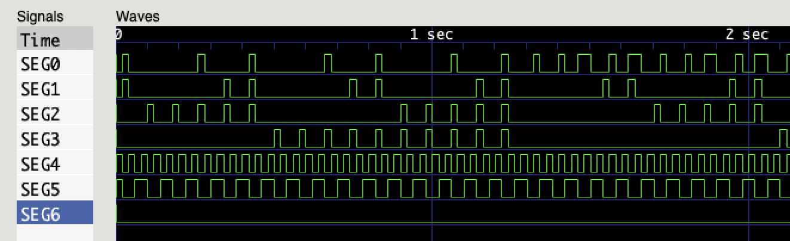

# FPGAOL v1.1 使用说明

**本文档已被迁移至[这里](https://git.ustc.edu.cn/hexuustc/fpgaol-examples)**

[FPGAOL](https://fpgaol.ustc.edu.cn)是由中国科大计算机教学实验中心组织开发的、基于Web端的线上硬件实验平台。用户可以远程访问我们部署好的FPGA（[Nexys 4 DDR](https://reference.digilentinc.com/reference/programmable-logic/nexys-4-ddr/start))集群，上传本地生成好的比特流文件，并交互地控制FPGA，实时获得FPGA的输出。因为该结果是实际运行而非仿真产生的，所以可以确保其与线下操作FPGA是相同的。同时，由于线上设备具备出色的采样性能，能够精确发现人眼难以观察到的信号变化，FPGAOL平台能为用户快速调试程序提供便利。



将FPGA部署在云上的方式，实现了实验资源的高效利用，也能帮助有需要的师生随时随地访问FPGA资源。目前，全校师生都可以通过统一身份认证登录FPGAOL平台，校外人士也可以通过游客账号使用本平台。

FPGAOL v1.1是FPGAOL平台的最近一次更新。本次更新带来的主要升级有：

* [新的资源获取机制](#获取FPGA)
* [支持快速扫描的七段数码管](#七段数码管)
* [采样精度为微秒级的波形图](#波形图)

本说明将介绍该版本的使用方法，并提供一些示例程序。为避免不必要的麻烦，我们**强烈建议**在实际编程中使用示例中提供的`fpgaol.xdc`文件。

**New**: 如果你对FPGAOL的实现感兴趣，欢迎阅读FPGAOL的[设计概要](./design.md)。

## 获取FPGA

本版本中，我们引入了更完善的FPGA访问控制机制，用户可以在登陆后点击`acquire`按钮，稍等片刻后页面将给出资源的访问链接。目前用户每次使用FPGA资源的时间默认为**10分钟**，超时后即被释放，用户也可以通过首页的`release`按钮主动释放FPGA。

## 开关与LED



FPGAOL v1.1的开关与LED部分与FPGAOL v1.0相比没有变化，管脚的对应关系为：

|  SW  |  0   |  1   |  2   |  3   |  4   |  5   |  6   |  7   |
| :--: | :--: | :--: | :--: | :--: | :--: | :--: | :--: | :--: |
| 管脚 | D14  | F16  | G16  | H14  | E16  | F13  | G13  | H16  |

| LED  |  0   |  1   |  2   |  3   |  4   |  5   |  6   |  7   |
| :--: | :--: | :--: | :--: | :--: | :--: | :--: | :--: | :--: |
| 管脚 | C17  | D18  | E18  | G17  | D17  | E17  | F18  | G18  |

为了避免上一版本中因频繁刷新LED导致页面卡死的情况，本版本的LED刷新间隔为**0.1 s**，快于该频率的LED变化将无法正常显示。

### 示例程序

LED和SW部分的[示例程序](./ledsw)直接将开关与LED相连，开关的变化将直接体现在LED上。

## 七段数码管



数码管分为hex_play和seg_play两部分，实验时我们主要用到的是hex_play。

### hex_play

七段数码管是本次更新中改进较大的部分。FPGAOL v1.1拥有了8个七段数码管，并且引入了更贴近实际的显示方式。

由于FPGAOL上的管脚数量有限，我们对数码管进行了一定的**简化**：在使能方面，不再通过8个管脚分别使能8个数位，而是仅使能由`AN[3:0]`所表示的二进制数所对应的数位；在显示的数字方面，不再通过`SEG`信号独立控制每个段（segment），而是直接显示`D[3:0]`形成的16进制数。**例如**，若`AN=3'b010, D=4'b1010`，则在下标为2的数位上显示`A`。

除此之外，数码管的使用方式与现实中无异。和现实中的数码管一样，我们建议的扫描频率为**50Hz**，也就是说，若要驱动8个数码管，需要一个**400Hz**的时钟。

数码管与FPGA上管脚的对应关系如下。**请注意**，如果你使用的是`Nexys-4-DDR-Master.xdc`，务必在使用时将对应行的`LVDS`改为`LVCMOS33`：

|  D0  |  D1  |  D2  |  D3  | AN0  | AN1  | AN2  |
| :--: | :--: | :--: | :--: | :--: | :--: | :--: |
| A14  | A13  | A16  | A15  | B17  | B16  | A18  |

在此简要说明七段数码管的显示方式。现实中的七段数码管是通过快速的扫描，利用人眼的视觉延迟来实现在不同的数位上显示不同的数字的，但在网页上，这显然不可能。于是在新版本的FPGAOL中，我们先对采集到的数码管控制信号进行预处理，按照七段数码管的显示原理计算出每个数位上显示的数字，并直接在网页上显示。

具体来讲，确定数码管每一位所显示数字的算法大致为：

```
while true:
  sleep(0.1)    // 每隔0.1秒刷新一次
  for i=0 to 7:
    for j=0 to 15:
      T[i][j] = 过去0.1秒内，AN为i且D为j的总时长
    max_j = index_of_max(T[i])  // 选择在第i位上被显示时间最长的数字
    display `max_j` on `i`
```

### seg_play

为了弥补hex_play不能按段来显示数字的缺陷，我们提供了seg_play，它是支持通过段来控制的一位数码管。为了节约管脚，它的控制信号是与LED共享的，可以通过LED的信号来控制它，具体的对应关系如下：



| 数码管 |  A   |  B   |  C   |  D   |  E   |  F   |  G   | 小数点 |
| :----: | :--: | :--: | :--: | :--: | :--: | :--: | :--: | :----: |
|  LED   |  0   |  1   |  2   |  3   |  4   |  5   |  6   |   7    |

### 示例程序

七段数码管的[示例程序](./seg)是一个以秒为单位的16进制计时器，当SW0为0时该计时器递增，反之则递减。

## UART



该功能还没做完，待补充。

### 示例程序

TBA

## 软时钟与按钮



FPGAOL计划提供一个速度比较慢的由软件驱动的时钟，以免去同学们给FPGA板载时钟降频的麻烦，但本版本的FPGAOL并没有提供该功能。

本版本的FPGAOL提供了一个按钮，该按钮**按下时为高电平，松开时为低电平**，按钮所对应的管脚如下。**请注意**，如果你使用的是`Nexys-4-DDR-Master.xdc`，务必在使用时将对应行的`LVDS`改为`LVCMOS33`。

| 按钮序号 |  0   |
| :------: | :--: |
|   管脚   | B18  |

## 波形图


在FPGAOL v1.0中，我们提供了一个实时刷新的波形图，但它的显示效果一般，最终成为了一个鸡肋的功能。在新版本中，我们去掉了这个实时波形图，转而将对FPGA的采样结果直接存储为**vcd**格式的波形文件，可以通过[GTKWave](http://gtkwave.sourceforge.net)等软件打开。



目前，该波形图的采样间隔为**5 us**，希望它能为同学们**调试程序**、助教**远程检查实验**等提供便利。本文作者在前不久就通过该波形图锁定了我们的测试比特流中存在的bug，所以我认为如果使用得当，这有可能成为FPGAOL的一个*killer feature*。

