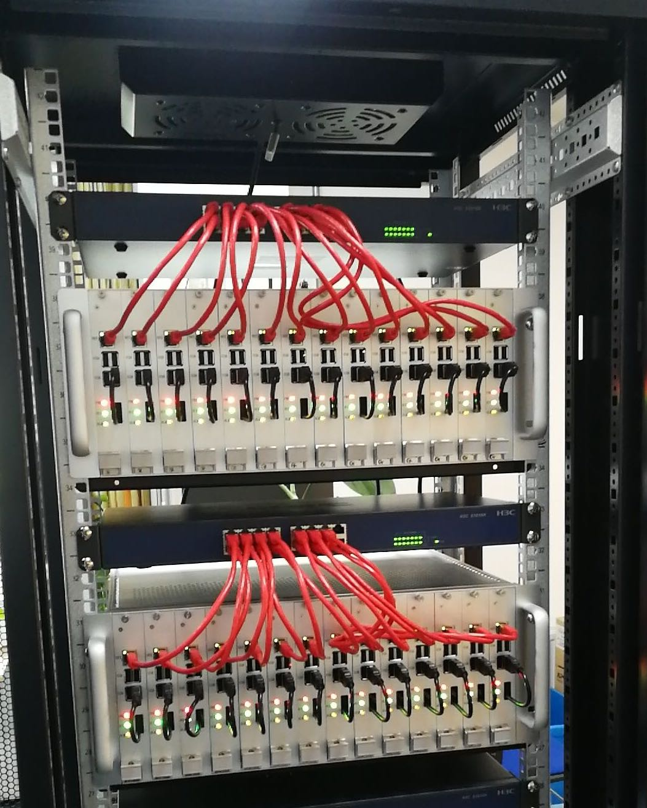
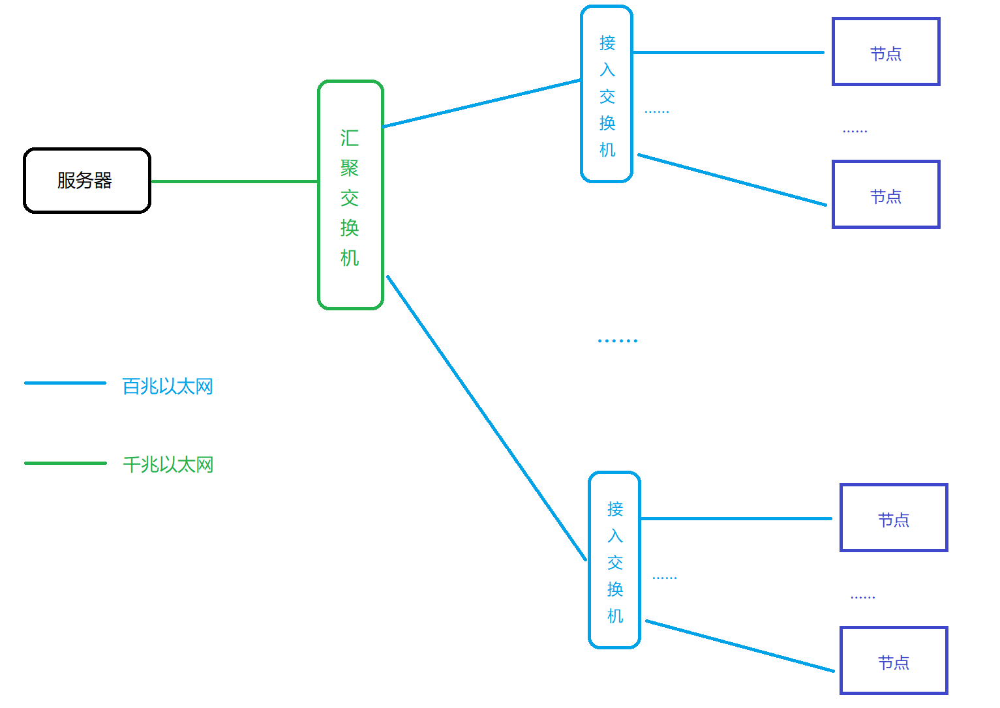
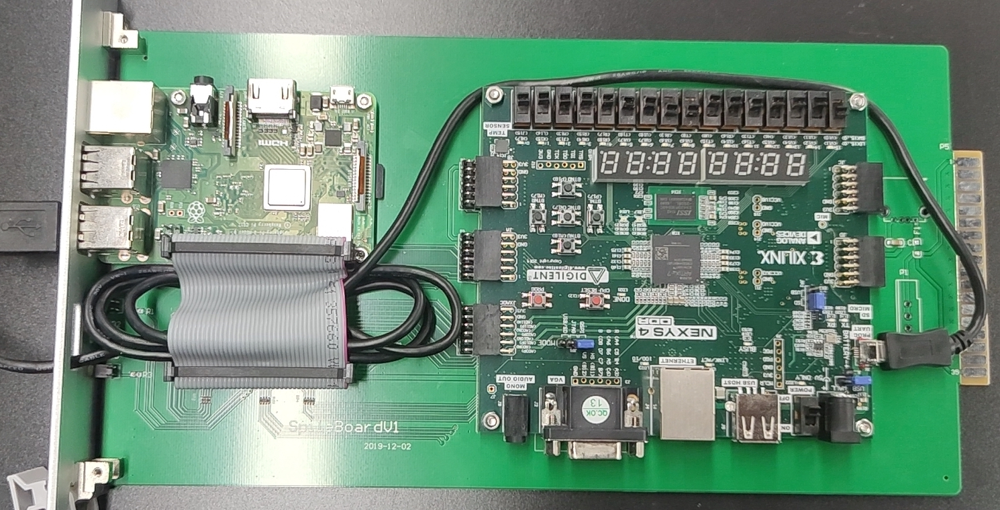

# FPGAOL Design Overview

在[FPGAOL](https://fpgaol.ustc.edu.cn)开发的过程中，我们不断地优化系统的性能，力图为用户提供和线下使用FPGA相同甚至更好的体验。我们进行了很多摸索，最终在有限的条件下支撑起了几十台FPGA节点的负荷。本文是对FPGAOL整体设计的总结，讨论了我们在一些重要问题上的思考过程和创新点，可以为日后的开发者或是希望深入了解FPGAOL项目的用户提供参考。

## 整体架构

FPGAOL采用了典型的Master-Worker的架构，一个**中心服务器**负责监控集群中各节点的工作状态并给用户分配FPGA资源，每个**节点**由一台树莓派和一个FPGA组成。用户通过[HTTP](https://tools.ietf.org/html/rfc2616)访问中心服务器并通过[WebSocket](https://tools.ietf.org/html/rfc6455)实时控制树莓派对FPGA进行烧写和输入输出。下图为我们的FPGA集群的一角。



### Scale Up：减轻服务器的压力

从之前的描述可知，中心服务器是FPGAOL面对用户的接口，还负责控制整个集群，承担着比较大的压力。有趣的是，我们的服务器是一台十年前的奔腾双核台式机，性能并不出色。因此，从FPGAOL设计的初期，减轻服务器的压力，让我们的服务能轻松地从几台FPGA的规模扩展到几十台再到更多，一直是我们考虑的问题。

我们的解决方法是**将尽可能多的功能下放到集群中的树莓派上**。为此，我们在每台树莓派上都运行了一个Web Server，用户对FPGA的烧写和控制信号直接通过中心服务器上的**TCP转发**到达树莓派，树莓派对FPGA的采样结果也是直接发给用户。这样，中心服务器实际上充当了**网关**的角色，它不需要对用户和树莓派之间的通信进行任何处理，而只需要对网络数据包进行转发（每秒约1KB），计算开销很小。经过实验，同时工作的FPGA节点增加时，中心服务器的load average几乎不变。

在最新的FPGAOL v1.1版本中，我们还将渲染FPGA的控制页面的工作也从中心服务器下放到了树莓派上，这样，每个结点就完全实现了独立运行服务，与中心服务器无关。

### 高效利用网络带宽

FPGAOL的网络拓扑是一个树形结构，如下图所示：



尽管用户和树莓派之间的通信流量很小（1kb/s），但用户上传比特流的大小约为4MB，因此，一旦出现很多用户同时上传比特流的情况，网络的瓶颈处（汇聚交换机和接入交换机之间的百兆网）可能形成拥塞，**这会使得其他用户和树莓派间的实时通信出现丢包、卡顿**，严重影响服务质量，主要有以下两个解决方法：

* 按接入交换机对结点进行分组和**负载均衡**，尽量避免同一个分组中的多个结点同时上传比特流。
* 对用户上传的比特流文件进行压缩，减小带宽占用，经试验，可以将比特流压缩为几KB，效果较好。

## Master Node：中心服务器

如前一部分所述，FPGAOL的中心服务器是比较轻量的。除了为整个平台提供Web页面之外，它只负责对集群的管理和分配。以下为中心服务器的两个主要功能：

### Failure (& Recovery) Detection

初期的FPGAOL没有failure detection机制，导致用户有时会获取到未正常工作或不稳定的节点。后期我们引入了一个简单的binary failure detector，使得用户获取节点的正常率达到了95%以上，但仍有提升空间。

FPGAOL v1.0中failure detection较为困难的一大原因是硬件不稳定，**网线松动和电源接触不良**十分普遍，导致许多设备长期处在不稳定的状态，即**crash-recovery model**。尽管市面上有许多成熟的failure detector实现，但是他们大多面向设备故障后不会自动重启的**crash-stop model**，**对于不稳定的设备检测能力一般**。[这里](https://github.com/fandahao17/Phi-Accrual-Recovery)是一个尚在开发中的Phi-Accural failure detector的改进版，希望能提升其对不稳定设备的检测能力。

在FPGAOL v1.1中，因为有了**自制的PCB板和机箱**，硬件稳定性得到的极大的提升，基本不再出现设备掉线的情况，因此failure detector的作用不再那么重要了。

### 基于token的访问控制

在FPGAOL v1.0中，会出现用户实际访问FPGA的情况与后台的记录不符的情况，例如用户还在FPGA页面上，但后台误认为其已经释放了资源。在新版本中，我们引入了基于token的访问控制机制，来避免这种情况的发生。

具体来讲，用户使用FPGA的一个周期为：

* 用户申请FPGA，服务器为其生成token，并发给对应的树莓派
* 用户进入FPGA界面，树莓派验证其token，若正确方可进入（确保一个用户只有一个token）
* 用户退出FPGA界面，不释放资源（避免了页面刷新导致的资源重新分配）
* 时间到，用户释放资源

## Worker Nodes：树莓派-FPGA节点

FPGAOL集群中的每个节点由一个树莓派和一个FPGA组成，下图为FPGAOL v1.1中的一个节点：



在笔者看来，FPGAOL的升级过程就是不断将计算任务从服务器和浏览器下放到树莓派上的过程。以下是我们利用树莓派的计算能力提升FPGAOL服务质量的两个例子。

### 基于DMA的高精度采样

FPGAOL的目标是为用户提供与线下操作FPGA相同甚至更好的体验。因为树莓派是一个具有高速时钟的通用计算机，我们可以利用它来实现对FPGA信号的**高精度采样**，从而发现到人眼无法观察到的信号变化，帮助用户更好地理解自己的程序。

但是，在运行着Linux操作系统的树莓派上，高精度的采样并不容易：（1）采样需要访问物理内存，而我们一般只能访问进程的虚拟内存（2）我们的采样程序可能被其他程序抢占，导致我们无法获得完整的采样结果（3）如果采样率过高，我们的采样程序可能会占用过多的CPU资源。

解决采样问题的方式是[DMA](https://en.wikipedia.org/wiki/Direct_memory_access)，但是DMA也需要处理cache一致性等问题，笔者在[这篇文章](https://github.com/fandahao17/Raspberry-Pi-DMA-Tutorial)中详细介绍了我们是如何通过DMA实现**微秒级**的高精度采样的。

### 七段数码管的显示算法

七段数码管是FPGA上一个非常重要的输出部件，它是通过高频率的扫描，让人眼产生视觉延迟，从而达到在不同的数位上显示不同的数字的。然而，FPGAOL是基于Web端的，利用高频率的扫描进行显示是不可能实现的。因此，七段数码管的显示一度被视为FPGAOL中一个不可能实现的功能。

幸运的是，因为拥有了高精度的采样，我们得以根据采样得到的数据来**模拟数码管的显示过程**。也就是说，我们可以在树莓派上记录下扫描到每个数位时数码管要显示的数字和时长。经过一定时间后，对每一位，我们统计各个数字被显示的总时长，并取其中的最大值进行显示，若该位被使能的时间太短，就不在该位上显示数字。

以在4位数码管上显示数字`1234`为例，假设使能信号被一个200Hz的时钟驱动，我们的数码管模拟算法会记录下以下扫描信息：

|  时间（ms）  | 0-5  | 5-10 | 10-15 | 15-20 | ...  |
| :----------: | :--: | :--: | :---: | :---: | :--: |
| 被使能的数位 |  0   |  1   |   2   |   3   | ...  |
|  显示的数字  |  4   |  3   |   2   |   1   | ...  |

我们认为一个正常的数码管显示程序不会让显示数字的变化速度大于0.1s。因此间隔0.1s后，我们统计得到在第0位上，显示时间最长的数字为4，第1位为3，第2位为2，第3位为1，从而正确地得到每个数码管上显示的数字。

一个简化版的数码管显示算法为：

``` 
while true:
  sleep(0.1)    // 每隔0.1秒刷新一次
  for i=0 to 7:
    for j=0 to 15:
      T[i][j] = 过去0.1秒内，AN为i且D为j的总时长
    max_j = index_of_max(T[i])  // 选择在第i位上被显示时间最长的数字
    display `max_j` on `i`
```

## Help Needed!

尽管我们一直努力地完善FPGAOL的功能，但目前仍有很多不尽如人意的地方。如果你对这个平台如何工作很感兴趣，或是有好的点子，或是想让学弟学妹不再为玄学的硬件实验而发愁，欢迎加入我们，和我们一起改进这个平台！
